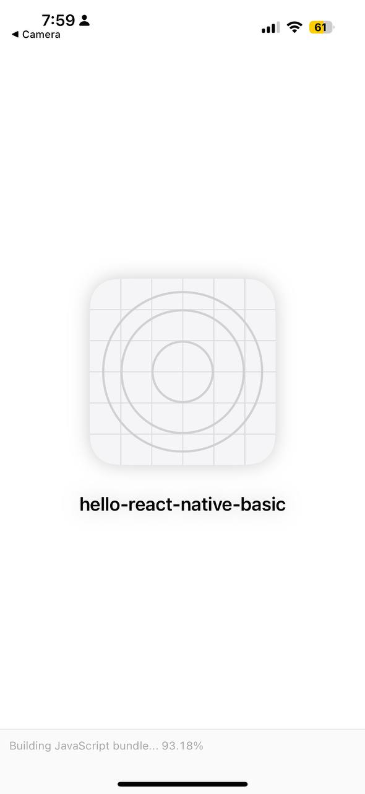

# 📱 Hello React Native Basic

A beginner-friendly React Native app built using **Expo** to demonstrate core concepts such as components, props, state management, and basic UI styling.

---

## 🚀 Features

- Functional components using JSX
- State management with `useState`
- Basic styling with `StyleSheet`
- Cross-platform compatibility (Android, iOS, Web)
- Hot reloading support via Expo

---

## 🛠️ Tech Stack

- **React Native** (JavaScript)
- **Expo**
- **VS Code** for development
- **GitHub** for version control

---

## 📷 Screenshots

<p float="left">
  
  
</p>


## 📦 Installation

1. Clone the repository:
   ```bash
   git clone https://github.com/yourusername/hello-react-native-basic.git
   cd hello-react-native-basic```

2. Install Dependencies:
   ```npm install```

3. Start the Development Server:
   ```npx expo start -c```

4. Scan the QR code in Expo Go app on your phone to preview the app.

---

## 📁 Folder Structure

```hello-react-native-basic/
├── App.js
├── assets/
├── node_modules/
├── package.json
├── README.md
└── .gitignore
```

## 🧠 Learnings

This project helped me understand:

  - How to set up a React Native project using Expo

  - JSX syntax and rendering

  - Passing data through props

  - Managing dynamic values using state

---

## 🧑‍💻 Author
Shashank Kumar Soni
[](https://www.linkedin.com/in/shashank0211/)
[](https://github.com/shashankksoni/ShashankKumarSoni)

---

## ⭐️ License
This project is licensed under the MIT License.


